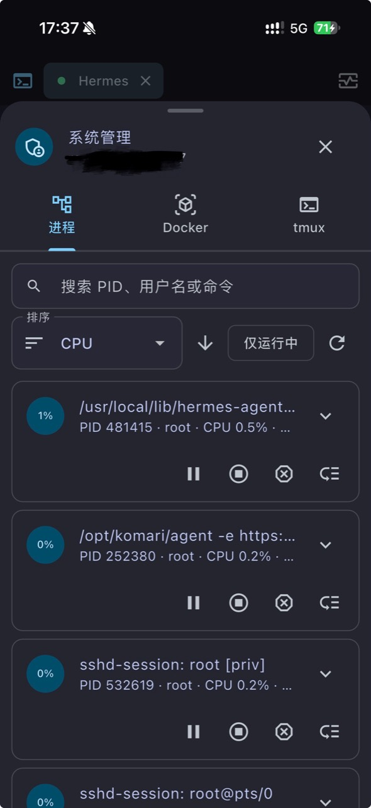
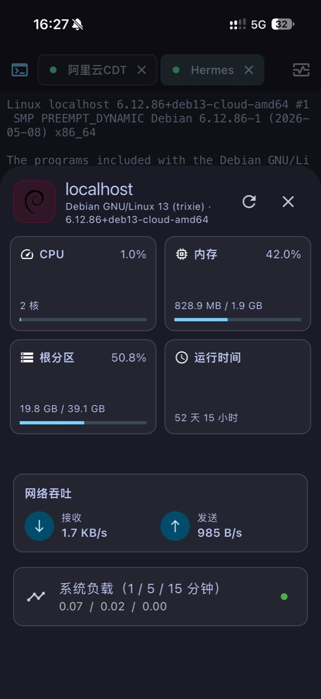

## 项目简介

Netcatty Mobile 是我使用 Flutter 开发的 Android / iOS 双端服务器管理工具。它延续了桌面版 Netcatty 的深色工作台设计、Vault 数据模型和 `netcatty-vault.json` 加密同步格式，并针对触屏、多任务、移动文件系统与系统安全存储重新设计了交互。

这是一个独立的开源移动端实现，并非 Netcatty 官方项目。

## 主要功能

- **SSH / Telnet 终端**：支持密码、私钥、跳板机、HTTP/SOCKS5 代理、端口转发、多标签、分屏、全屏、中文输入和自定义快捷键。
- **移动端 SFTP**：提供单栏与双栏文件管理，支持跨服务器传输、上传下载、批量操作、压缩解压和远程文本编辑。
- **系统管理**：可在当前 SSH 会话中管理进程、Docker、Compose、systemd/OpenRC 服务、Caddy 与 tmux 会话。
- **性能监控**：实时查看 CPU、内存、磁盘、网络吞吐、系统负载和运行时间。
- **加密云同步**：支持 WebDAV、GitHub OAuth/Gist 与 S3，并与桌面端使用相同的三方合并和删除墓碑机制。
- **安全存储**：敏感信息分别保存在 Android Keystore 或 iOS Keychain，云端保险库使用 PBKDF2-SHA256 与 AES-256-GCM 加密。
- **个性化体验**：内置网格、列表、树形主机视图，50+ 终端主题、命令片段、自定义背景和中英文界面。

## 界面预览

### 服务器工作台

### 系统管理与性能监控

### 终端主题

## 平台支持

| 能力 | Android | iOS |
| --- | --- | --- |
| SSH / Telnet / 多标签终端 | 支持 | 支持 |
| 后台连接 | 前台服务通知保活 | 提供短暂后台收尾与画中画 |
| 画中画 | 实时 Flutter 终端画面 | 原生终端文本帧 |
| 手机文件 | SAF 挂载授权目录 | “文件”App 中的 Netcatty 目录 |
| 安装包 | 签名 APK | 可重签的无签名 IPA |

## 下载与源码

Android APK 和 iOS IPA 可前往 [GitHub Releases](https://github.com/kmh1145/Netcatty-mobile/releases/latest) 下载。完整源码、开发文档和构建说明位于 [Netcatty-mobile 仓库](https://github.com/kmh1145/Netcatty-mobile)。项目采用 GPL-3.0-or-later 许可证。
